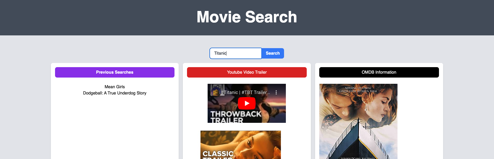

# Project 1 - Movie Search Web App

## Link to Deployed Application

A link to the deployed application can be found here: https://annalisedev.github.io/moviesearch/ 

## Description

This project required us to come up with an idea for a interactive front-end application web application leveraging HTML, CSS, Tailwind as a CSS framework, Javascript and JQuery. The external APIs that we used for our Movie Search Application were Youtube and OMBD. The application allows the user to search for movies, when they do they are presented with a list of options to select from based on key word search. When they select from this list, the site shares key Youtube Trailers for the film, as well as surfaces movie data from OMDB including the poster, awards, IMDB rating, Genres and Key Actors. The purpose is that the user should have enough informaiton to decide if this is a film they want to watch. Previous searches are saved to local storage, duplicates are removed and only 7 search are displayed to the user.  

The Github Repository can be found here: https://github.com/annalisedev/moviesearch 

## Screenshot

A screenshot of the deployed application can be found in assets:

## Support

Some external sources that supported us to understand the task and write the code are linked below;

How to create a YouTube API key 2021 - https://www.youtube.com/watch?v=yuM7KH-JLu8 
JS for the Youtube API - https://lekansogunle.medium.com/building-a-youtube-player-with-video-search-api-589f3d385e3d
How To Show YouTube API results in your HTML Website using JavaScript - https://www.youtube.com/watch?v=K9G3Yc0pw9g
5 ways to center a div in Tailwind CSS - https://www.youtube.com/watch?v=NZp7WjzhoDs 

